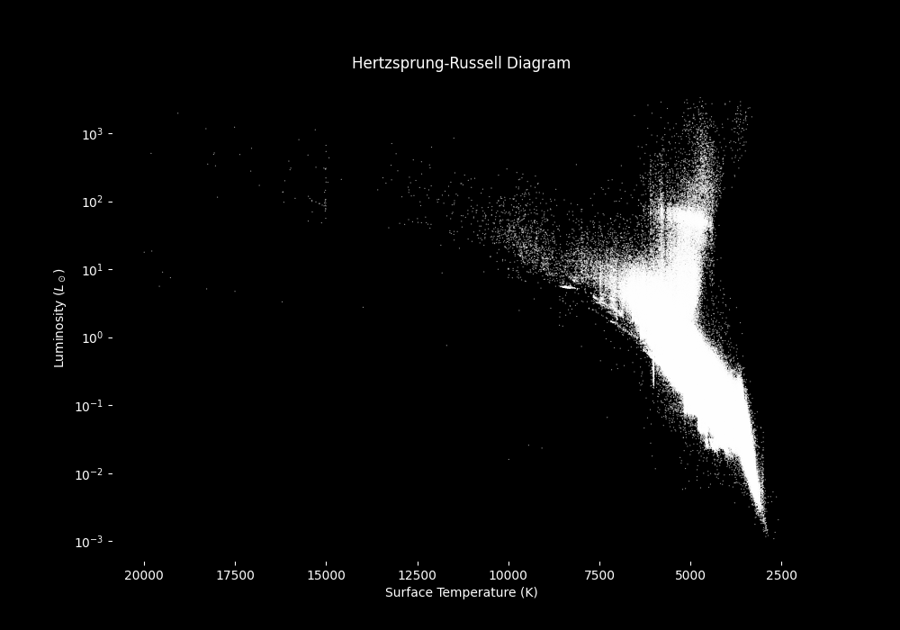

# Hertzsprung–Russell Diagram from Gaia Star Data

This project creates a Hertzsprung–Russell (HR) diagram using stellar data, such as surface temperature and luminosity, from the Gaia archive. The final plot shows how stars are distributed according to their surface temperature in Kelvin and luminosity in solar luminosities.

## Example HR Diagram



The diagram uses a logarithmic luminosity axis and an inverted temperature axis, which is the conventional layout for HR diagrams. Hotter stars appear on the left, cooler stars appear on the right, and more luminous stars appear higher up the graph.

## Project structure

```text
HR-Diagram/
│
├── H-R graph.py
├── gaia_hr_data_1million.csv
├── gaia_downloader.py
└── README.md
```

## Requirements

This project uses Python. The main libraries needed are:

```text
pandas
numpy
matplotlib
astroquery
```

## Explanation of the HR diagram

A Hertzsprung–Russell diagram shows the relationship between a star's surface temperature and luminosity. It is one of the most important diagrams in astrophysics because it reveals different stages of stellar evolution.

Looking at Fig. 1,
The dense diagonal band running from the upper-left region toward the lower-right region is the main sequence. Main sequence stars are in the stable part of their life cycle where they fuse hydrogen into helium in their cores. Hot, luminous main sequence stars appear toward the upper-left, while cooler, dimmer stars appear toward the lower-right.

The group of stars above the main sequence represents evolved stars, such as giants and supergiants. These stars are very luminous compared with main sequence stars of similar temperatures because they have expanded to much larger radii.

The lower-left region of an HR diagram is where white dwarfs are usually found. White dwarfs are hot but faint because they are very small. In this particular graph, that region is not strongly populated, which may be due to the sample selection, data filtering, or the limits of the Gaia data used.

## What could be improved

A larger sample size of stars, this graphs has 1 million stars but due to the nature of this there would be 

The current scatter plot uses many white points, which makes the main structure visible, but it can also cause dense regions to become overplotted. A density plot, hexbin plot, or smaller transparent points would make crowded regions easier to interpret.

The diagram would also be clearer if stellar regions were labelled directly on the graph, such as:

- Main Sequence;
- Red Giants;
- Supergiants;
- White Dwarfs.

